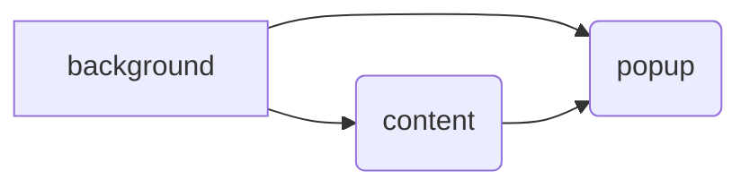

# Procrastination blocker

## About
This is a personal project. I wanted a Chrome extension that would block non-productive websites for me.

Similar extensions already exist, where you can blacklist URLS (eg Reddit, or YouTube), but I wanted something a bit more sophisticated. I wanted something that could tell the difference between a productive YouTube video/Reddit post (eg a YouTube video for a programming tutorial) vs a non-productive one (eg most YouTube videos - I tend to go down a rabbit hole of watching a whole bunch of cooking videos.

This extension works by having you mark non-productive/productive websites as you browse. Over time, the algorithm learns to classify certain websites as productive, or non-productive.

It's a really fun project. The algorithm isn't particularly sophisticated, but it is lightweight, and it's just a fun experience to work with a model as you see it grow with the data you feed it.

## Installing/building the extension
I've submitted it to the Chrome extension store - still waiting on approval :(

You can run `bun install` , then `bun run build` - I chose to use Bun as a package manager just because I love how fast it is. `npm install` and `npm run build` SHOULD also work, although I haven't tested it.

Once built, you can open up the Chrome extensions folder and test it by pointing it to the `/build` directory.

## How to use

## Challenges I faced

### Modifying the Naive Bayes algorithm
The algorithm being used to classify websites is a fairly simple, modified version of the Naive Bayes algorithm. 

The conventional Naive Bayes algorithm - at least when using plain token frequencies like I'm doing - does not perform well when one particular category has significantly more tokens than the other. It ends up skewing and biasing more to the side with less tokens, especially when encountering unseen tokens.

When using websites as the source of data, this situation is quite common - it is highly unlikely that websites will have similar numbers of words to each other.

I spent a long time modifying the algorithm to perform a certain way. I'm still not completely happy with it, and the modifications (particularly when handling unseen tokens) arguably 'violates' some of the main assumptions of Naive Bayes, but it is otherwise functional for now.

### Handling the content script
The content script injects JavaScript into the page, in order to display an overlay when the user visits a non-productive website.

This has two issues:
1. CSS from the page can and will interfere with the overlay. The solution to this was using a Shadow DOM object, but this presents its own problems - namely, it pretty much breaks the UI framework I was using (ChakraUI)
2. Single page apps completely change the lifecycle of the content script - you would normally expect it to be cleared and run again whenever navigating to a new page, but this doesn't happen with single page apps. I had to create a listener for the navigation change (using the experimental navigation API that still doesn't have TypeScript annotations). 
It's still not completely bug free, but it's otherwise functional.
I am also aware of the irony of complaining about single page apps while using React as a framework for the UI.

## Project architecture
I'm not sure if there is a 'canonical' architecture for a Chrome extension. I initially wanted to do a typical 'clean architecture' MVVM style with a data, domain, viewmodel, and view layer, similar to my experience in mobile apps.

I had to give up pretty quickly. The extension has three separate entities (background script, content script, and popup script), all with 3 different lifecycles. At any point, only one may be active, and the other two may be completely cleared from memory by the Chrome runtime. They do not share anything in memory, and can only communicate through an API supplied by the Chrome runtime.

The architecture roughly works around these three entry points. `background.ts` provides the overall business logic, and is where the data and domain classes are set up. `content.ts` and `popup.ts` primarily contain view logic, and communicate with background through message passing - see the message passing folder.

Despite `background.ts` being where the business logic lies, both `content.ts` as well as `background.ts` act as a source of truth. Ideally, I would pass all the data from `content.ts` back to `background.ts` and let `background.ts` be the source of truth, but this is not possible. 

This is because the background script is often cleared from memory by the Chrome runtime, whereas the content script lifecycle is always guaranteed to be active while the browser is active. Hence it acts as the source of truth for data about the current tab, and `popup` uses receives data from both `background.ts` as well as `content.ts` to receive data.

### Data flow

